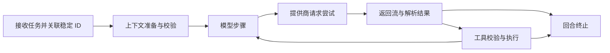

# 内置上下文查看实施方案

> 状态：准备完成，待实施。本文描述下一轮开发范围，不代表功能已经可用。
>
> 基线：`v3.3.16` / `main@ad56db35d3677685afe0d93296b544206e07f5ae`。
> 该版本已发布，发布代码已同步回 `develop`。准备分支：`codex/context-inspector`。
>
> 首期目标：在司命内看到一次任务实际发送了什么、收到什么、执行了什么，以及失败发生在哪里；为后续上下文优化提供可信数据。

## 1. 产品范围

首期提供“本轮调用”查看器：从项目助手、立项会话和任务详情进入，按执行顺序查看上下文准备、模型步骤、各次请求尝试、工具调用及最终结果。PC 与 Android 独立运行同时交付；Gateway 复用服务端采集能力。

查看器只读取诊断记录。生成、修改资料、保存草稿、建档、暂停、恢复与重试继续使用现有业务入口。首期不增加自动压缩策略、自动修复、重新执行工具或一键重放任务。

内置原生采集、存储与界面，不打包 Phoenix 服务。首期支持本地诊断包导出，后续以同一记录格式对接可选的 OpenTelemetry/OTLP 分析工具。外部分析工具的许可与分发条件继续独立管理，见[现有诊断工具说明](../scripts/observability/README.md)。

## 2. 已确认的代码基础

| 当前实现 | 能复用的内容 | 需要补齐的观测边界 |
| --- | --- | --- |
| [权威模型 Gateway](../backend/app/modules/model_runtime/infrastructure/gateway.py)、[执行端口](../backend/app/modules/model_runtime/application/execution.py) | 模型绑定、统一调用、重试和续接 | 一个逻辑调用下面每次真实发送，以及成功、取消、失败的完整生命周期 |
| [OpenAI 兼容适配器](../backend/app/ai/openai_adapter.py)、[Anthropic 适配器](../backend/app/ai/anthropic_adapter.py) | 已适配的 Chat Completions、Responses、Messages 协议 | 最终请求体、流式返回与适配后的输出分别记录 |
| [ContextFrame](../backend/app/services/conversation_context/context_frame.py)、[执行账本](../backend/app/services/conversation_context/execution_ledger.py) | transcript revision、checkpoint、工具事务、预算、哈希和实际回执 | 把当时的帧、清单和真实请求关联，不能事后用当前数据库内容替代 |
| [工作台工具执行器](../backend/app/services/workspace/executor.py)、[立项回合运行时](../backend/app/services/creation_agent_turn_runtime.py) | 参数、权限、实体归属、执行和模型可见结果 | 覆盖调用模型之前的拒绝，以及工具内部嵌套的生成请求 |
| [现有运行事件](../backend/app/services/observability/run_events.py) | 面向作者的进度、检查点和失败元数据 | 现有运行事件继续负责进度；请求详情作为关联诊断记录，不另建任务状态机 |
| [上下文治理页面](../frontend/src/pages/ContextGovernancePage.tsx)、[预览组件](../frontend/src/components/ContextPreviewPanel.tsx) | 来源清单、预算估算和清单详情 | 尚无完整请求与响应，增加入口并复用一个调用详情组件 |
| [Android DirectApiClient](../mobile/android/app/src/main/java/com/siming/mobile/data/network/DirectApi.kt) | 本机 OkHttp 请求、流式读取、重试与两种 API 协议 | 手机本地采集、存储和查看，不依赖 PC 进程 |
| [CLI 输出处理](../backend/app/ai/local_cli_output.py)、[CLI 适配器](../backend/app/ai/local_cli_adapter.py) | 传入提示词、结构化事件、标准输出解析 | 在归一化前观察事件；外部 CLI 未暴露的内部 API 请求仍不可见 |

`backend/app/ai/gateway.py` 只是导出层，不能在那里建立第二个采集入口或业务 Gateway。现有 [ADR 007](architecture/adr-007-agent-conversation-context.md) 是上下文和压缩的权威约束；本功能观察其运行结果。

## 3. 一次任务要记录哪些内容

每个节点都有明确的来源、顺序和完成状态。准备失败也保留任务记录；没有发生网络请求时，不产生虚构的 API 调用节点。

### 3.1 上下文

- 保存当时的 `conversation_context_frame.v1`、ContextManifest 引用和已准备内容的快照；来源具有真实 ID、版本或内容哈希。仅有引用而无快照时明确标注，后来的当前资料不能冒充当时输入。
- 分开展示系统契约、较早会话 checkpoint、最近原文、最新用户消息、当前回合账本、未消费工具事务及任务资料。原始消息顺序沿用 transcript 的 `sequence_no`。
- 展示最终实际开放的工具类别、工具名、Schema 哈希及请求中的工具定义。初始只开放 `set_tool_categories` 的规则不变。
- 记录模型绑定、提示词和配置指纹、输入预算、输出预留、容量可信度及计数器类型。对已有 checkpoint 的生成、校验、修正、CAS 结果分别建立关联节点。
- 当确有当时的组件快照和最终请求时，可做结构差异查看；对无法准确归属的协议包装和 token 保留“未归属”，不编造组件占比。

### 3.2 模型请求与返回

- 在提供商参数适配、JSON 序列化之后观察实际请求；记录协议、模型、脱敏后的目标地址、请求体和派发状态。应用准备的逻辑 messages 作为另一层数据保存。
- 每次物理请求使用独立 `attempt_id`。SDK 重试、Gateway 重试、流中断续接及修正请求需分别关联其原因；不能只记录最终成功的一次。
- 响应分为“提供商返回”“适配后输出”“最终展示内容”。原生工具调用、普通正文中的 DSML 字样、解析失败不能混为同一种工具执行事实。
- 流式读取采用旁路观察，分块大小有界，不提前读完整响应、不重复消费流、不改变下游内容或取消行为。保存流是否结束、是否缺失终止帧、HTTP 状态及解码状态。
- `reasoning_content` 等字段仅展示提供商实际返回的内容；未返回的内部思考无法查看。
- 用量区分提供商实报与本地估算。输入、输出、缓存读写的未知字段为 `null`；保留提供商原字段，避免重复计算缓存。费用只有在用量和价格依据完整时才计算，否则显示“未知”。

### 3.3 工具与任务结果

- 按原生 `tool_call_id` 关联调用、原始参数、契约校验结果、实际执行器回执和送回模型的投影结果。查看器不修改参数，不把文本恢复成可执行调用。
- 失败优先使用业务端明确给出的 `reason`、`path`、`failure_class`、`retryable` 和阶段；没有结构化错误时标记未分类并显示脱敏详情，不用关键词另做语义判断。
- 工具前置校验失败、提供商失败、输出解析失败、事务回滚、任务取消和诊断记录缺失是不同状态。成功写入只能由实际持久化回执证明；模型声称“已保存”不算证据。
- 暂停和恢复沿用现有 Operation/Run 的身份和状态，记录恢复后的新执行片段；重试产生新尝试并关联之前记录，不覆盖旧错误。
- MCP 只记录司命实际接收和执行的契约边界；不猜测外部 MCP 服务或外部 CLI 内部做了哪些请求。

## 4. 共享数据契约草案

首个实施提交固化 `siming.context_trace.v1`，由同一机器可读 Schema 和合成样例约束 Python、TypeScript、Kotlin。本文先定义字段语义，不增加尚无实现的产品 API 或能力声明。

| 对象 | 必须表达的字段与约束 |
| --- | --- |
| Trace | `schema`、随机 `trace_id`、`origin`、`scope`、`turn_id`、起止时间、业务状态和独立的采集状态 |
| Scope | 带类型的 `project_conversation`、`creation_session`、`system_conversation` 或 `operation`；携带对应的真实 ID，不能要求尚未建书的立项会话具有 project ID |
| Correlation | 已存在时关联 message、conversation、session、operation、run、manifest ID；记录开始时允许 message ID 未生成，之后追加关联事件 |
| Span | `span_id`、`parent_span_id`、`kind`、`step_index`、`attempt_id`、结构化状态与错误；跨进程任务通过显式 links 关联 |
| Event | `event_id`、`trace_id`、`source_id`、进程内单调递增 `sequence`、墙钟时间、单调时钟耗时及事件类型；同一来源的顺序不能依赖墙钟 |
| Payload | `payload_id`、语义层、媒体类型、记录字节数、已知时的完整大小、脱敏与截断状态、保留内容哈希及采集边界 |
| Usage | 原字段、归一化的可空输入/输出/缓存统计、来源 `provider_reported` 或 `estimated`、计数器/价格版本；未调用、未采集和提供商未返回分别表示 |
| Coverage | 各层覆盖状态、缺失原因、限额截断、采集错误、丢弃事件数；不能用单个“完整”覆盖全部层次 |

Payload 的语义层固定为 `context_frame`、`provider_request`、`provider_response`、`adapter_output`、`tool_arguments`、`tool_receipt`、`model_visible_tool_result`、`cli_input`、`cli_event`。视图据此命名，不把保存的历史摘要当作 provider request。

采集范围与内容处理分别表示：例如 `capture_source=http_transport`、`completeness=complete`、`redaction=applied` 表示“在该边界完整观察到，但保存的是脱敏副本”，不表示原始字节未被处理。取消、大小超限、未知压缩、未开启记录分别具有明确的缺失原因。

哈希必须标明作用对象：现有 ContextFrame/工具回执的业务哈希原样关联；诊断存储哈希针对实际保存的脱敏内容。诊断哈希不能替代原生事务校验，也不能拿脱敏后内容与业务哈希直接比较。

同一 trace 内按来源序号和父子关系组织；跨设备记录只按显式因果链接关联，无法证明先后的并发事件展示为并行。列表分页使用稳定的存储游标，不能因迟到事件重排作者消息。

## 5. 采集架构与入口覆盖

诊断领域契约及查询归 `operations` 模块管理，通过轻量观察端口与各业务模块连接；存储和传输观察器属于 infrastructure，由 [composition](../backend/app/bootstrap/composition.py) 显式组装。观察端口不能依赖具体 SQLAlchemy 会话或反向导入业务执行器。

主流程只提交有界的不可变事件或数据块，异步写入独立诊断库。采集、序列化、落盘或导出失败不能改变工具返回、关闭写工具、触发模型重试或使业务请求失败。磁盘满和队列满时停止接收相应诊断内容、统计丢弃并在界面显示；不能静默标成完整。

| 路径 | 首期采集位置 | 完整性声明 |
| --- | --- | --- |
| PC/Gateway API | 权威 Gateway 关联模型步骤；在实际使用的 HTTP 客户端派发及响应读取边界观察每次请求 | 支持当前 OpenAI 兼容 Chat/Responses、Anthropic Messages；自定义代理、客户端 mounts、重试和流式分支均需测试 |
| DeepSeek、Qwen、Gemini | 复用现有 OpenAI 兼容客户端工厂，随各适配器最终协议采集 | 不根据提供商品牌另建一套调用路径；当前 Gemini 使用的是兼容接口 |
| Android 直连 API | `DirectApiClient` 关联逻辑调用，OkHttp 实际 exchange 与响应 source 关联物理尝试 | 覆盖普通与流式调用、Chat/Responses、重试与取消；记录保存在手机 |
| 本机 CLI | 启动时输入和实际输出的结构化事件；在现有输出归一化之前旁路记录 | 只能声明 CLI 边界；外部进程内的最终提示词、压缩和未暴露的 API 请求标记不可见 |
| 本地模型 | 记录司命能够观察的 adapter 输入、输出；有真实 HTTP 边界才记录 provider request | 以实际运行能力声明覆盖程度 |
| Android Gateway | Gateway 采集它实际执行的请求；手机关联受权访问的远程记录 | 手机关闭 PC 客户端后仍可连接独立 Gateway；无 Gateway 时使用完整的手机直连查看能力 |

接入观察器必须保留原有 base URL、路径、鉴权、代理、`trust_env`、TLS、超时、连接池、重试策略和流式契约。不能为采集改用中转 API、注入提供商追踪头或额外请求模型。

已有诊断启动脚本的全局 monkeypatch 只用于当前开发诊断。原生采集交付时，同步删除 `live_capture.py` 的重复采集实现、对应启动接管逻辑及旧测试，更新文档；Phoenix 启动和明确标注缺失项的历史导入可以保留为独立分析工具。日常产品只使用一个原生观察路径。

## 6. 本地存储、权限与资源上限

以下是首期实现默认值，不是 3.3.16 已有配置：

| 设置 | PC / Gateway | Android | 说明 |
| --- | --- | --- | --- |
| 默认记录级别 | 摘要 | 摘要 | 只记调用身份、结构化状态、耗时、计数和关联 ID，不记消息正文与参数值 |
| 完整内容记录 | 用户开启后记录新任务 | 同左 | 可选择持续开启或 60 分钟诊断时段；时段到期后新 trace 回到摘要级，已开始的 trace 仍受容量限制 |
| 默认保留期限 | 7 天 | 7 天 | 按整个已结束 trace 清理，业务 transcript 和 checkpoint 不受影响 |
| 诊断数据总预算 | 256 MiB | 128 MiB | 包括索引、payload、写入日志和临时采集文件；手机差异只控制空间，不减少业务能力 |
| 单个请求/响应内容采集上限 | 16 MiB | 16 MiB | 仅限制诊断副本；真实模型请求和响应照常运行 |

存储使用独立 SQLite/Room 数据库与受限的 payload 存储，独立迁移，不把大请求体写进业务数据库、作品目录或同步 outbox。设置中的预算、计时和清理策略只有一个权威配置路径。活跃 trace 不因过期被半截删除；空间不足时停止内容采集，保留能够写下的摘要与缺失原因。进程意外退出的未完成 trace 标为采集中断，不能改写业务状态。

首个实现阶段必须把内存队列、每块缓冲、并发采集、解压后大小和数据库日志增长限制纳入压力验证；16 MiB 单 payload 上限不等于允许每个并发请求都在内存保留 16 MiB。用户清空诊断记录时，清理范围限于诊断数据，不能影响任务恢复信息或未保存草稿。

诊断记录包含创作内容，默认留在执行端应用私有目录，不自动云传、不随作品同步或 Android 备份导出。授权后的 Gateway 查看使用其独立诊断查询接口，不通过 PC 页面代办，也不将所有远程记录隐式复制到手机。

HTTP 鉴权头、Cookie、URL 用户信息与查询串不采集；请求体凭据字段和异常里的已知密钥在任何落盘、日志和导出前脱敏。未知二进制、无法安全解析的截断 JSON/SSE 只保留大小、状态和缺失原因，不落盘未审查的片段。创作正文不是自动脱敏的对象，开启完整记录及导出前明确提示会包含正文、历史和工具结果。

查询、删除和导出都验证当前桌面会话或 Gateway 设备身份，并逐项校验 trace scope 和 payload 的归属。知道 `trace_id` 或传入任意 project/session ID 不构成访问授权。远程 HTML、Markdown、错误内容只按不可信文本显示。

## 7. 界面与读取契约

PC 消息操作增加“查看本轮调用”，复用 `frontend/src/features/contextInspector/` 中的独立功能组件；上下文治理和任务详情也进入该组件。左侧按步骤列出调用树，右侧提供输入、输出、工具结果、上下文来源和统计；首次打开优先显示本轮失败节点。

Android 使用同一信息层级的列表和详情页，从助手、立项消息及任务详情进入；在应用关闭重开、没有 PC 和 Gateway 的情况下，也能查看已保留的本机调用、切换记录设置、清理和导出。

实现中需要以下查询能力，准确路由由正式 schema 提交确定，全部沿用 `/api/v1` 与现有鉴权边界：

- 按显式 scope、稳定 message/turn/run ID 获取 trace 列表；允许失败回合还没有最终助手消息。
- 分页读取 trace 的步骤和增量事件，按 payload ID 延迟读取有界内容；列表接口不返回全部历史正文。
- 获取和设置诊断采集策略、查询容量；删除本地诊断记录、生成经过相同脱敏管线的诊断导出包。
- Gateway 请求的 scope 必须与已授权业务资源相符；手机本地 Repository 实现相同查询语义，不要求启动 HTTP 服务。

切换消息或 trace 后，取消或忽略旧详情请求。诊断事件不作为新的助手消息插入会话，不改变原有消息顺序和自动滚动。正文、JSON 和 SSE 详情大数据分页或虚拟化，超限时显示实际截断标识，不冻结界面。

用户应能明确区分“记录未开启”“记录已过期”“该路径不提供此层数据”“提供商没有返回此字段”“采集失败”。没有旧记录时，不用当前项目资料拼出一个看似真实的历史请求。

## 8. 导出与后续压缩分析

首期诊断包包含版本化 `manifest.json`、按序的事件和脱敏 payload，携带应用版本、各层覆盖状态、来源、文件大小和保留内容哈希。仅导出用户选中的范围；导出时再执行一次同一脱敏策略。查看内容和导出无需 Phoenix 进程或 Python 环境。

后续 OTLP exporter 消费相同 Trace/Span/Payload 记录，不再添加采集路径。导出地址需要用户显式配置，默认关闭自动上传。大正文不能直接无限塞入 span attributes；使用大小预算、摘要和明确引用，保留覆盖/截断标记。

压缩分析先观察既有行为：每轮实际请求大小、消息/工具组成、实报和估算 token、缓存、重试次数、checkpoint 生成成本、错误与完成结果。随后再做同一合成任务与数据快照的策略对比，记录模型绑定、配置、输入差异和验证口径。

离线读取和模拟回放只能验证程序逻辑、数据契约与成本估算，不能证明另一套提示词的模型质量。需要真实效果对比时，在隔离数据和禁用业务写入的实验环境中进行另行明确的模型实验；首期查看器不提供自动实跑入口。

## 9. 按提交拆分的实施顺序

| 阶段 | 主要落点 | 可验收交付 |
| --- | --- | --- |
| 1. 共享契约与存储 | `operations/domain` 的 trace 值对象；application 观察/查询端口；infrastructure 独立存储；`contracts/fixtures` 的合成跨端样例；Android `data/observability` | 三端读取同一事件语义；字段完整性、归属校验、限额、清理和失败隔离可验证 |
| 2. PC/Gateway 真实采集 | 权威模型 Gateway、现有 provider 客户端工厂、工具执行及 ContextFrame 的边界；拆出小观察器，避免继续扩大现有超大函数 | 一次立项失败可以区分前置校验、模型请求、工具回执和最终展示；API 地址与行为保持一致 |
| 3. PC 查看器与导出 | `frontend/src/features/contextInspector`；现有消息、立项和治理页面组合；正式 API schema 与生成类型 | 按消息查看调用树、内容、来源、统计与覆盖状态；清理和导出有效，迟到请求不串线 |
| 4. Android 同期实现 | `DirectApi.kt` 的观察接入；`MobileWorkspaceAgent`、`MobileCreationConversationAgent`、本地上下文 runtime；独立 Room 库和 Compose 页面 | PC 关闭、无 Gateway 时可完整采集/查看/导出；同一合成失败与 PC 的关键状态一致 |
| 5. CLI 覆盖与发布验收 | 当前 CLI 事件入口；现有诊断脚本收敛；API/跨端契约、文档和打包门禁 | CLI 边界清楚，重复采集代码移除，安装包中无需运行 Phoenix |

阶段 3 和 4 属于同一产品验收范围，完成 PC 页面不能声称首期已完成。正式实现时同步更新 `contracts/mobile-pc-parity.json`、生成的 API 类型和相关文档，能力状态只写实际已通过的结果。

## 10. 必须通过的验收

| 场景 | 验证结果 |
| --- | --- |
| 普通 JSON、SSE、Chat、Responses、Anthropic | 实际发送内容与记录的脱敏副本对应；工具定义、provider state、正文与思考字段各归其层 |
| API 路径与网络行为 | 记录开关前后请求域名、路径、鉴权、代理、超时、重试次数、输出数据与取消一致；mock 准确捕获每次物理尝试 |
| 重试、续接、400/429/5xx、断流与取消 | 尝试不被覆盖；错误阶段、部分响应和缺失用量准确；诊断失效不导致新的业务重试 |
| 角色 ID 不存在、枚举错误、提案 revision 冲突 | 前置错误带字段位置和原因；未发生的内部生成请求不能出现在树中；无新增资料写入 |
| 模型正文出现 DSML / 原生工具正常调用 | 普通文本与实际 tool call 区分；显示解析/最终回复校验结果；查看器不会执行或恢复工具 |
| 工具写入、投影与 checkpoint | 真正提交、回滚和模型可见内容分别记录；checkpoint 丢失、过期或 CAS 失败不能假装成功 |
| 两个并发会话、重开应用、暂停恢复、时钟偏移 | scope 不混用，父子关系和序号稳定，持久化记录可重新查看，迟到事件不扰乱聊天消息 |
| Android 独立运行 / Gateway 授权 | 无 PC/Gateway 的本机流程可完成；有 Gateway 时不能跨设备授权范围读取诊断正文 |
| 摘要/完整开关、到期、大小上限、队列满、磁盘满 | 原始业务请求完整运行，诊断内容有界，缺失原因可见；清理不删除业务历史和恢复数据 |
| 凭据和导出 | API key、鉴权头、查询凭据、异常密钥不进入任何持久化副本；导出保持脱敏和覆盖标记 |
| 性能与安装包 | 记录开/关对照检查首字延迟、主线程阻塞、内存和磁盘增长；流式消费不等待完整抓取；PC/Android 安装版均无需额外服务 |

日常回归使用 HTTP mock、合成上下文、临时数据库和共享跨端样例，不使用作者真实创作记录作为仓库测试数据，也不因运行测试额外消耗模型 token。性能门槛在阶段 1 的基准测量后明确记录，再作为首期发布门禁。

## 11. 本轮准备完成的边界

本轮完成 3.3.16 的发布与分支同步，并确认以上现有代码落点、首期范围、共享数据语义、跨端要求和实施顺序。此分支目前只有准备文档；没有新增产品接口、采集代码、界面、依赖或数据库迁移。
