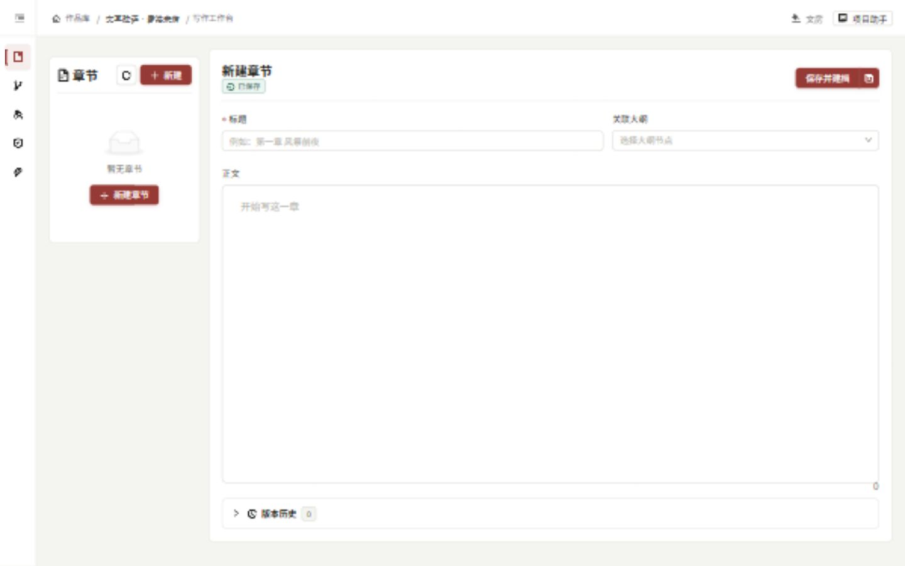
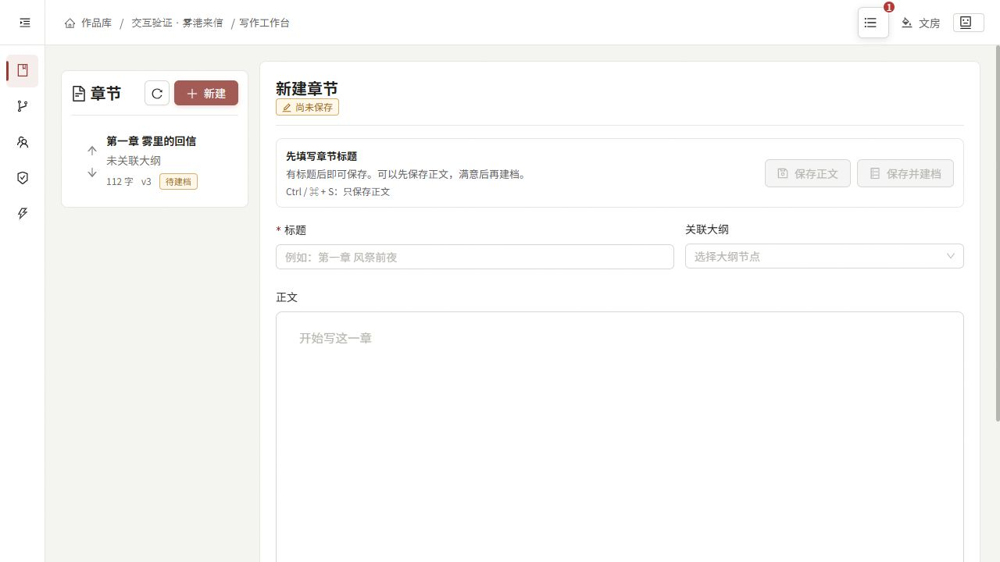
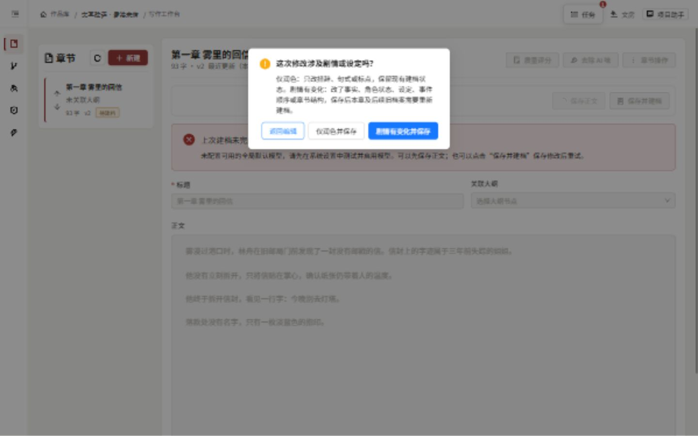
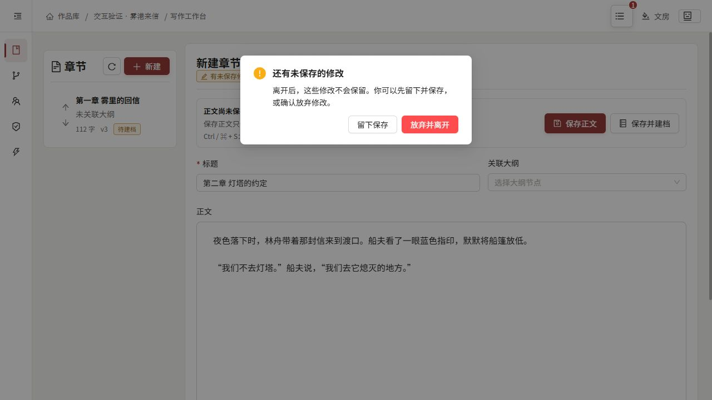

# 司命：写作交互可用性优化与验证

日期：2026-09-05。基线：`dcf46329ed59e36e229bf782dc66068c841b2aef`（3.3.13）。工作分支：`codex/hci-usability-20260905`。

## 本轮结论与范围

本轮围绕作者的三个问题修改真实产品：**内容保存了吗、为什么暂时不能建档、操作不满意怎么退回**。重点是 PC 写作工作台与 Android 正文编辑，不改变 Agent 的意图理解、工具选择、建档数据模型或后端权威写入路径。

采用实际界面操作、代码检查与自动化测试交叉验证。心理学与交互原则用于选择改动方向；没有招募用户进行对照实验，因此不声称节省了某个百分比的时间，也不声称完成了全面无障碍认证。本轮不是服务器集群可用性或十万字创作压力测试。

## 改动依据

| 原则 | 本轮应用 | 可检查的结果 |
| --- | --- | --- |
| 识别优于回忆，降低额外记忆负担 | 把藏在下拉菜单里的“仅保存”改成常驻“保存正文”；保留独立建档入口 | 作者无需先猜测图标或展开菜单才能保存草稿 |
| 系统状态可见，减少反馈解释成本 | 明确区分尚未保存、提交中、已保存待建档、正在建档和失败 | 显示状态来自真实编辑与任务状态，不从用户自然语言猜测 |
| 用户控制与错误预防 | 保存影响对话框提供两个明确保存选项及独立“返回编辑” | 取消不发写入请求；不把取消当作剧情变化后继续保存 |
| 及时且可恢复的反馈 | 建档错误常驻，说明正文是否已保存及如何重试 | Toast 消失后仍可找到失败原因与恢复入口 |
| 降低误触及操作竞争 | 常用按钮扩大点击区域；保存期间锁定会改变正文的相关操作 | 重复提交不产生第二次写入；快捷键只保存正文 |

参考：[Nielsen 可用性原则](https://www.nngroup.com/articles/ten-usability-heuristics/)、[系统状态可见性](https://www.nngroup.com/articles/visibility-system-status/)、[用户控制与自由](https://www.nngroup.com/articles/user-control-and-freedom/)、[W3C 目标尺寸最低要求](https://www.w3.org/WAI/WCAG22/Understanding/target-size-minimum.html)、[W3C 状态消息](https://www.w3.org/WAI/WCAG21/Understanding/status-messages.html)。这些资料支持设计原则，不构成本产品的效果测量。

## 问题、处理与证据

| 编号 | 发现的问题 | 影响 | 本轮处理 | 验证依据 |
| --- | --- | --- | --- | --- |
| HCI-01 | 新建空白章节显示“已保存” | 容易误判数据已经落盘 | 显示“尚未保存”；标题为空时说明如何启用保存 | 界面步骤 1、WriterPage 回归 |
| HCI-02 | 保存正文藏在拆分按钮菜单，默认操作会同时建档 | 不满意正文的作者容易误以为必须先建档 | 常驻两个文字按钮，未保存时突出“保存正文”，保存后突出“开始建档” | 界面步骤 1、2 |
| HCI-03 | 原生确认框的“取消”实际选中 semantic，仍继续保存并使旧建档失效 | 按钮含义与用户预期相反，可能造成非预期写入 | 删除原生确认路径；三选项对话框，返回编辑抛出取消信号，Writer 保持脏状态 | 界面步骤 4、API 边界测试、后端影响语义测试 |
| HCI-04 | 建档启动失败依赖短暂消息，轮询又可能清掉错误 | 用户不知道正文是否丢失、能否重试 | 错误常驻；只在任务运行或成功等确定状态下清除；重试调用原建档 API | 界面步骤 3、后台失败及重试测试 |
| HCI-05 | 建档失败后继续修改，错误标题仍声称“正文已保存” | 已保存正文与新修改的状态混淆 | 标题改为“上次建档未完成，当前修改尚未保存”，允许先保存正文 | 界面步骤 4、后台失败回归 |
| HCI-06 | 提交中缺少统一的即时防重入与相关编辑保护 | 重复点击或同时执行正文操作容易产生竞争 | 保存入口立即加锁，禁用输入、新建、候选应用/撤销、排序及恢复入口；失败或取消后解锁 | 延迟保存测试与代码检查 |
| HCI-07 | Android 手工编辑的返回/放弃缺少未保存保护，保存失败主要依赖全局提示 | 容易丢失修改或不清楚保存结果 | 系统返回与页面返回走同一保护；保留编辑内容与失败原因；提交中禁用编辑并阻止重复点击 | Android 编译与代码检查；尚无真机交互验证 |
| HCI-08 | Android 某些不可执行的草稿保存按钮仍可点击，离线状态说明不够准确 | 点完才得知版本或连接限制 | 从真实草稿状态派生按钮可用性与原因；区分生成中、冲突、只读对比、空标题、离线修订 | Android 草稿状态单元测试 |

## 实际界面走查

测试使用独立目录 `.build/hci-usability-20260905`，作品为通过司命界面创建的“交互验证·雾港来信”，项目 ID 为 `0cc79d83-9cec-4b8b-85ba-d054b0d9ebe5`。没有修改正式用户作品，没有把正式模型密钥复制进测试目录。正文为测试操作时人工输入的短篇样本，不能作为 AI 长篇生成能力的证据。

1. **新建章节——通过。** 修改前空白新章显示“已保存”；修改后显示“尚未保存”，标题为空时两个保存按钮都不可用，并显示填写标题的指引。填写标题后两个入口都可见可用。
2. **只保存正文——通过。** 从界面保存第一章；保存后正文仍可继续编辑，建档需要单独发起。第二章在未保存离开提示中选择留下后成功保存为 v1，正文 62 个非空白字符。没有因为点击“保存正文”自动生成下一章。
3. **建档失败恢复——通过失败分支。** 测试配置没有可用的全局默认模型，实际启动建档失败。错误持续显示缺少模型的原因、已保存正文安全，以及重试方式。没有把失败伪装成建档完成；成功建档分支本轮未连接真实模型复跑。
4. **取消正式章节修改保存——通过。** 第一章 v2、93 字的基础上增加一段，按 Ctrl+S。新对话框默认焦点在“返回编辑”。点击后正文仍在编辑器、状态仍为未保存；从读取 API 核实正式章节仍是 v2、93 字。再次点击保存并明确选择“剧情有变化并保存”，正式章节成为 v3、112 字，仍为待建档。仅润色选项的 HTTP 头传递由真实 Axios 自定义适配器测试验证；最终追加的界面补测因浏览器控制超时未完成。
5. **误离开未保存章节——通过。** 输入第二章正文后点击第一章，出现确认框，默认焦点为“留下保存”。选择留下后第二章标题和正文仍在，随后只保存正文成功。
6. **窄屏与键盘——部分通过。** 390 × 844 CSS 像素视口下读取 DOM：页面 scrollWidth 为 390，两枚保存按钮均宽 255、高 40，未产生横向页面溢出。桌面保存按钮最小高度 36，章节排序按钮 28 × 28。Ctrl+S 实机交互通过；Cmd+S 的事件路径由单元测试覆盖。没有进行屏幕阅读器、放大 400% 或 Android 真机无障碍验收。

以下截图均来自本轮真实页面。基线与最终截图存在视口尺寸差异，仅用于核对状态与操作，不用于像素级视觉对比。

### 新建章节：修改前

### 新建章节：修改后

### 修改保存：独立取消选项

### 未保存离开保护

## 工程验证

验证日志位于 `.build/hci-usability-20260905`。系统响应明显变慢后，主动停止重复打包，避免继续叠加构建负载。中止的运行不记作通过。

| 检查 | 当前结果 | 日志或测试位置 |
| --- | --- | --- |
| 前端写作、交互组件、API 保存确认、项目助手交接 | 保存/取消/失败提示等变更 33/33 通过。最后补充的相关操作禁用保护完成 TypeScript 检查；其重复测试长时间无结果后主动中止，不计作通过 | `frontend-final-tests.json`（最后一次完成的通过记录）、`frontend-final-tests.log`（补充复跑） |
| TypeScript 与 Vite 生产构建 | 最终 TypeScript 检查通过；最终 Vite 在完成 3302 模块转换后主动中止。此前一轮生产构建通过 | `frontend-build.log` |
| 前端依赖与功能边界 | 234 模块，453 依赖，无违规 | `frontend-architecture.log` |
| 章节 API 与建档影响语义 | 30/30 通过 | `backend-chapter-tests.log` |
| Android 全量单元测试 | 273/273 通过；随后仅调整一条离线说明文案。最终重复打包中止，未再次执行到测试任务 | `android-tests-ascii.log`、`mobile/android/app/build/test-results/testDebugUnitTest` |
| Android Debug 构建 | 首轮通过；最终 Kotlin 编译通过，DEX 打包阶段因运行环境延迟主动中止 | `android-final.log` |

前端测试覆盖：空标题、新章状态、Ctrl/Cmd+S、延迟保存防重入、保存失败保留内容、取消不写入、建档失败持续显示、重试不另存新版本、后台失败不覆盖作者编辑，以及现有 AI 草稿/修订候选工作流。

API 边界测试使用真实 Axios 与内存适配器，验证取消零请求、两个明确影响枚举正确送入同一 API、调用方已经提供结构化影响时不再次询问。后端测试验证 `style_only` 保留建档投影以及 `semantic` 的失效处理；没有新建另一套前端建档逻辑。

Android 测试覆盖离线新章可保存在手机、在线保存/建档选项、离线修订不能覆盖正式版本，以及生成中、空标题、版本冲突、只读对比等状态。Windows 中文路径曾导致 Gradle 测试进程找不到 `GradleWorkerMain`，使用临时 ASCII 盘符映射与独立 Gradle 缓存后通过；该环境问题不记作业务断言失败。Vitest 的对话框测试关闭 CSS 动画，避免 jsdom 不发 transition-end 事件造成残留弹窗，仍使用真实对话框按钮和真实 API 封装。

构建仍有现有的大分块提示、部分旧页面体积告警及依赖弃用告警；不将它们描述为本轮已经解决。

## 平台契约与明确限制

- 保存正文仍使用现有 `save_only`，建档仍使用现有 `save_and_catalog` 或章节建档 API；API、CLI、MCP 的 Agent 工具与意图选择未改动。
- PC 新章与 AI 草稿仍先独立展示，只有显式保存才写入正式章节；没有新增自动续写或自动建档。
- Android 通过现有本地保存/同步仓库处理写入，UI 不以 PC 页面当前状态代办。离线新章仍可保存在手机。
- **已有移动端能力差异未在本轮消除：离线建档以及离线修订候选覆盖正式章节仍需要后续工作。** 本轮明确呈现这些限制，不能据此宣称手机已能脱离 Gateway 完成全部创作/建档流程。PC 的手工保存影响选择是既有功能，本轮修复其取消行为；Android 现有手工保存仍使用默认 semantic，本轮没有新增仅润色影响选择。
- Android 没有可用的真机或模拟器，本轮未验证返回手势、输入法、旋转恢复或 TalkBack 的实际表现；编译和状态单元测试不能替代这些验证。
- 最后一次界面补测中浏览器控制连续超时，终端命令也明显变慢。未证明原因是产品缺陷或机器资源问题；本报告保留此前实测证据，并明确记录被中止的补充构建，不宣称最终安装包已验收。
- 编辑器字符数仍包含换行，章节列表使用非空白字符数。本轮实测第一章编辑器 118、落盘字数 112，属于现存统计口径差异，尚未统一。
- “保存正文”的确认对话框要求作者判断修改影响，仍有学习成本；后续可以单独研究更清楚的说明，但不能通过关键词规则替作者或 Agent 猜测语义影响。

截至 2026-09-05 13:43（北京时间），实现与走查文档已完成，最终补充测试/打包和 Android 真机验收仍有上述缺口。停止已知的重复验证任务，并移除了本轮创建的临时 `S:` 盘符映射；没有删除测试作品或正式作品数据。

本轮不发布 Release、不推送或合并 main，不更改版本号。改动保留在工作分支，尚未提交 Git commit；不能将本报告作为最终安装包发布验收。

## 重启后的本地安装包补充验证

2026-09-05 用户重启电脑后，重新为当前工作区构建 Windows 本地测试安装包。输出目录为 `release/local-hci-20260905`，版本仍为 3.3.13，不包含 PR #82。原 `release/Siming-Setup.exe` 未覆盖。

- `npm ci` 完成，TypeScript 检查通过，Vite 生产构建通过（日志记录 5 分 21 秒）。这次完成了前文提及的最终前端构建缺口；没有把此前中止的运行改记为通过。
- 锁定的 75 个 Python 打包依赖通过版本检查和 `pip check`，PyInstaller 完成 Windows 程序封装及版本资源检查。
- 包内 136 个前端文件与本次 `frontend/dist` 逐字节一致，且产物包含新的保存确认文案。
- **原有 MCP 30 秒检查连续两次超时，默认流水线未通过。** 独立诊断确认约 110.88 秒才返回初始化响应，约 119.11 秒正常退出。随后通过独立诊断脚本保留全部原有功能断言，将每次进程等待显式延长到 180 秒；两次进程分别耗时 64.234 秒和 43.828 秒，153 个工具、环境隔离、创建/写入、JSON Patch 持久化、退役迁移版本规范化及备份均通过。仓库默认检查脚本及 30 秒限制未修改，不能把诊断结果说成默认时间门槛通过。
- 从同一份已封装程序继续执行仓库原有 `installer/Siming.iss`，安装器编译完成（270.188 秒），SHA-256 校验通过。未签名，仅用于明确的本地手动安装测试，不用于应用内自动更新或正式发布。

新增待调查问题 **PKG-01：本机打包产物 MCP 初始化较慢，超过默认 30 秒检查限制**。目前未定位到具体慢点，需进一步区分模块导入、数据库初始化和运行环境耗时。这不是桌面窗口启动耗时测量，也不能据此归因于某个用户配置或本轮界面改动。

PyInstaller 另外记录了依赖扫描子进程退出超时，以及 `winpty/OpenConsole.exe` 的两个 `ext-ms-win-uiacore` 依赖未解析警告。此次 MCP 检查没有覆盖 Windows 终端会话和 WebView2 界面；这些功能仍需实际安装验证。本次也没有补跑全量回归、Android 真机或真实模型长篇生成。

证据：`.build/local-installer-20260905/build-after-reboot.log`、`mcp-retry.log`、`mcp-startup-diagnostic.log`、`full-mcp-diagnostic.log`、`installer-finalize.log`。交付目录附带 `README-测试说明.md`、`build-info.json`、`frontend-integrity.json`、`mcp-diagnostic.json` 和 `Siming-Setup.sha256`，保留已通过的功能检查及未通过的默认超时检查之间的区别。
